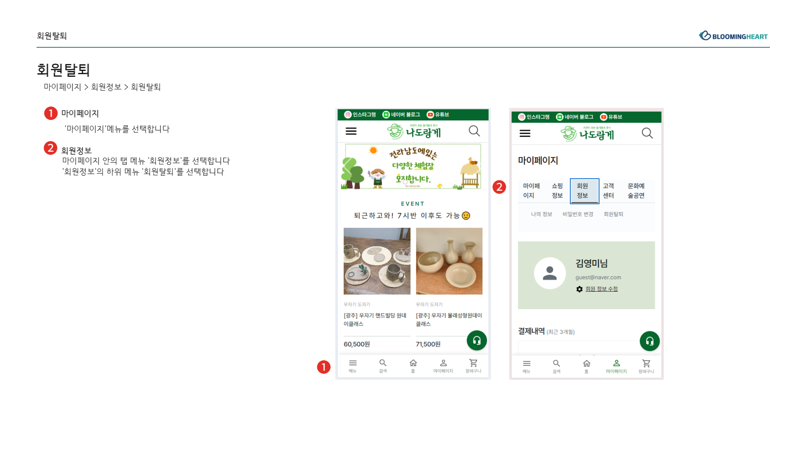
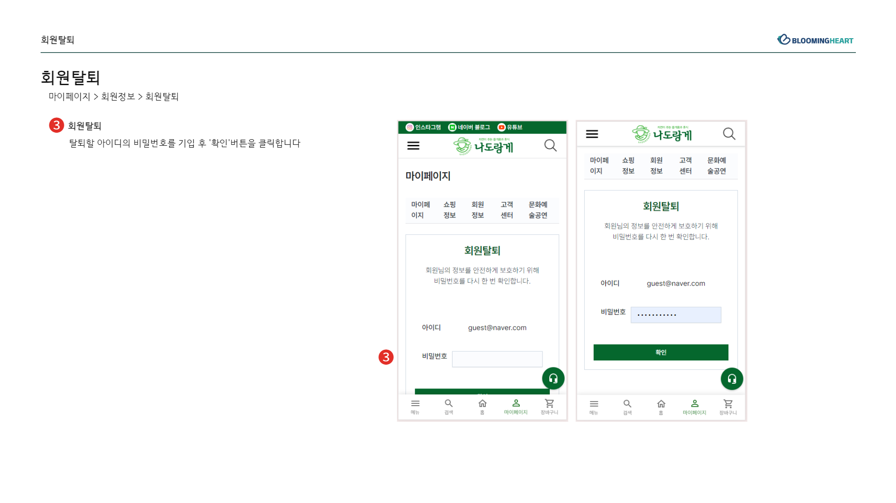
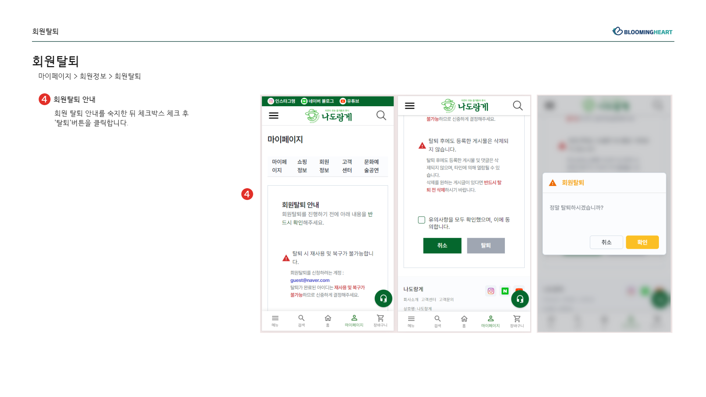

회원탈퇴 설명서 

- 나도랑게/ 김지현

로그인 후 내정보 접근:

데이터 삭제 절차:
"사용자가 회원탈퇴를 요청하면, 즉시 해당 사용자와 관련된 모든 개인정보를 영구적으로 삭제합니다."

즉시 삭제 원칙:
"회원탈퇴 요청이 접수된 즉시, 사용자의 개인정보를 모든 시스템에서 제거하고 복구가 불가능한 방식으로 파기합니다."

예외 사항과 보존 기간:
"법적 요구 사항이나 서비스 운영을 위한 목적으로 필요한 경우를 제외하고는, 회원탈퇴 이후 사용자의 개인정보를 보존하지 않습니다."

법적 요구 사항 및 정책 변경:
"법률적으로 요구되는 경우나 회사의 정책 변경으로 인해 일부 정보를 보존해야 하는 경우, 해당 사항에 대한 이해 및 동의를 얻은 후에만 예외적으로 처리합니다."

고객 지원 및 문의처:
"회원탈퇴 및 개인정보 처리와 관련된 추가 문의사항이 있을 경우, bheartkor@gmail.com로 문의하시기 바랍니다."